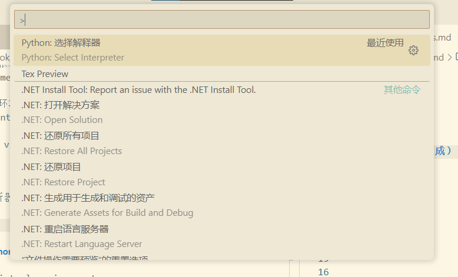
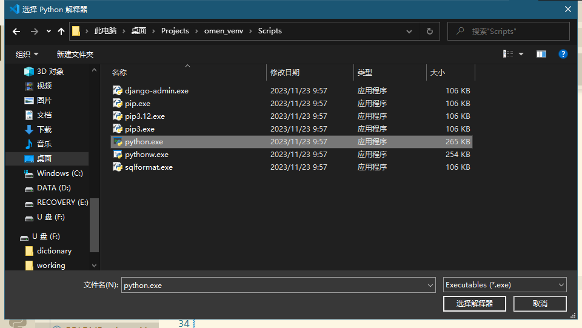

# cook_backend

## 0.配置该项目的 python 虚拟环境
创建一个python虚拟环境create a virtual environment

    python -m venv <venv_name>

激活虚拟环境activate the virtual environment:

    .\venv_name\Scripts\activate

为虚拟环境安装python项目的依赖

    pip install -r requirements.txt

生成/更新 生成的python虚拟环境

    pip freeze > requirement.txt

关闭虚拟环境deactivate the virtual environment:

    deactivate

配置 vscode python 代码解析器

- ctrl+shift+p

- python 选择解释器

- 选择输入路径

- 选择 <venv_name>/Script/python.exe, 完成

## 1.日常使用配置好的 python 虚拟环境

激活虚拟环境activate the virtual environment:

    .\venv_name\Scripts\activate

关闭虚拟环境deactivate the virtual environment:

    deactivate

## 2.测试开发 django 项目

启动开发服务器 Start Server

    python manage.py runserver 

创建新应用 Create app

    python manage.py startapp <appname>

数据迁移 migrate

    python manage.py makemigrations <appname>

    python manage.py migrate

网站admin 账号密码 Admin

    username: admin
    password: admin